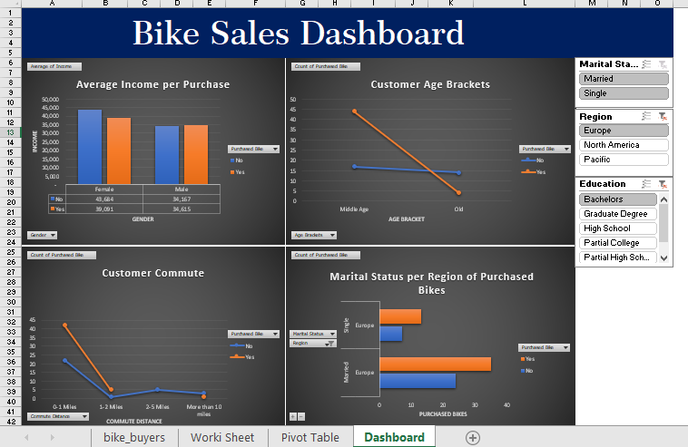

# Bike Sales Dashboard Excel

This project was conducted to analyze customer characteristics and their impact on bike sales. By examining factors such as 
customer commute patterns, average income per purchase, customer age brackets, and marital status, we aimed to gain insights 
into the demographics and preferences of bike buyers.

The Excel file which includes both the data and dashboard are available in this repository.

## Summary
Data was sourced from "Alex the Analyst" on YouTube.

## Skills Used in Excel
1. Data Cleaning
2. Data Validation
3. Data Visualization
4. Pivot Tables
5. Formulas (SUMIFS, COUNT, CORREL, custom calculations)

## Dashboard Sample

